## Having fun with Large Language Models

In 2023, I joined a small multidisciplinary [Data Science team](https://github.com/cityofcapetown/ds_team) at the City of Cape Town. In my new role, I've had the opportunity to work on a few Natural Language Processing (NLP) projects, which has included experimenting with applications of large language models (open-source and proprietary). Yes, working for government can be cutting-edge, and I'd encourage folks with stats, econ, social science and data science skills to consider the civil service.

This has been a lot of fun --- I've learned how to work with text embeddings, to use various forms of semantic search, to implement retrieval augmented generation (RAG) workflows, and more.

All very neat, but gosh it has been tough just keeping one's bearings with so much hype. I'm thankful for people like Simon Willison (<https://simonwillison.net/>) who has managed to walk the line between excitement and caution (so you'll see some links to Simon's blog).

I am not an "LLM expert" but I've had the opportunity to struggle with various models and workflows, and have learned some lessons along the way. A lot of these lessons have been conceptual --- what is an LLM, how does it work, what is it doing, and what are going to be good uses for it.

So some notes below --- running notes, really --- with practitioners in mind.

## "Generative" AI is a sub-field of "Artificial Intelligence" and uses Machine Learning

-   **Artificial Intelligence** (AI) is a field that is devoted to building systems that emulate human or animal intelligence[^1]
-   **Generative AI** (GenAI) is a flavour of AI that leverages techniques developed in the Machine Learning field
-   GenAI systems use patterns and relations identified in vast amounts of text or image or sound data to **generate** new (synthetic) content in response to a user's instructions[^2]
-   "Generative" AI models can generate coherent text, image, audio, video, or a combinations of different modalities, and more
-   Where there is a large collection of example data, the techniques of GenAI can be used to generate more of it --- in interesting and often helpful ways. **This is a very powerful idea, with real-world applications and unique challenges**
-   The basic techniques (from Machine Learning, and Deep Learning) are not brand new, but advances in computing power have enabled researchers and practitioners to scale to an immense degree with hugely impressive, controversial[^3], and lucrative results

[^1]: I am paraphrasing <https://plato.stanford.edu/entries/artificial-intelligence/index.html#ref-1>

[^2]: See <https://en.wikipedia.org/wiki/Generative_artificial_intelligence> for an overview

[^3]: Worth reading re copyright law: The New York Times' case against Microsoft and OpenAI (<https://www.nytimes.com/2023/12/27/business/media/new-york-times-open-ai-microsoft-lawsuit.html>)

## LLMs and systems built on-top of LLMs --- a quick distinction

-   **LLM:** Just a chat model, where the user interacts with the LLM in text and the LLM uses the text to generate (synthetic) answers. Here the LLM only uses its training weights and the user's prompts to produce responses
-   **LLM+:** A system that has been built on-top of an LLM, or with an LLM at its core, where the LLM can generate text AND access other systems. Here the LLM has been linked, by design, to other applications or programs and can do things like access the internet, access third-party software, open links, open programs, run code, search private data-bases, &c. based on what the user has asked
-   Practitioners sometimes talk about "compound models" which is another way to talk about an LLM+ system where an LLM is used in conjunction with other processes that feed into it, e.g. an LLM that searches a data-base or the internet to find relevant (i.e. semantically related) information to concatenate to a prompt before generating an answer
-   **Note:** It is becoming more difficult to make this distinction because the most popular implementations of the technology, which most of us are exposed to, are in the LLM+ category --- LLMs with integrated web-search and more. Nonetheless, it is useful to keep the distinction in mind to understand what the systems are doing and where the LLM comes into play

## LLMs are synthetic text generators built out of vast amounts of example data

-   The question/answer LLMs we are familiar with (think: basic ChatGPT) are created by algorithmically calculating patterns and relations between words and sentences from vast amounts of (semi-curated) human knowledge, i.e. text from the internet, blogs, news sites, books, &c.[^4]
-   LLMs need **redundancy** to thrive (lots of similar-ish examples)
-   This mathematical process of establishing and encoding these relationships is called **"training"**, and can take **weeks or months** to complete and is very expensive to do (but getting cheaper!). One ends up with a sort of "compressed" impression, or "gestalt" of the content, encoded as numerical relations between "tokens" --- a **"base-model"**
-   The volume and quality of the training data is important. And while it can take long, and costs a lot of money (because it needs special hardware and computing power), the process is not complicated
-   Next: Those patterns, or "parameters" are then augmented with examples of how the creators would want the output to look and sound like, quality scores on generated output, corrections, restrictions, and so forth. This involves human feedback, special examples, and (increasingly) automated processes built on those. This iterative process is called **"fine-tuning"** and can take **hours to days**, and is relatively cheap to do. Fine-tuning can be used to produce models for specific purposes, such as producing a friendly chat assistant --- an **"assistant model"**
-   One can train and fine-tune models for very specific or niche purposes
-   An assistant model "answers" questions by using the user's question + its fine-tuned parameters to generate more words and sentences --- words that are likely to follow-on from the text it has received and the history of the conversation
-   Given that this is a probabilistic or "stochastic" process, the output can often be surprising, insightful or even original...sometimes wildly wrong or totally fabricated. In the best case, the output is **useful**
-   Researchers and practitioners can use commercial or free open source models for their purposes, and further augment or fine-tune them as needed

[^4]: See this interactive article in the FT "Generative AI exists because of the transformer" (<https://ig.ft.com/generative-ai/>), and for a deeper dive: Andrej Karpathy's "LLMs for busy people" (<https://www.youtube.com/watch?v=zjkBMFhNj_g>) \| YouTube

## Using LLMs takes a bit of getting used to

-   **Given that the model's parameters contain all kinds of useful relations determined from tons and tons of human knowledge (text from the internet and books and news sites, &c.)...and that it "generates" or builds answers on the fly based on how a question is asked...how should one think about using it?**
-   One should use a good measure of "skeptical pragmatism"[^5]
-   Often one is trying to "influence" or bias the LLMs output in a desired "direction", trying to get a useful answer "out"
-   **Implications:**
    -   Output isn't necessarily going to be "correct", in fact it may be wildly wrong! LLMs can and do "hallucinate", because that is an inherent part of how they work
    -   Output may not be reliable or reproducible. The output is stochastic, so will be slightly different on each generation
    -   It's **trial-and-error** regarding this idea of "prompting" the model in the "right", i.e. **useful**, direction, whether that means working on effective prompts, or giving the model bits of context to check itself against ("grounding"), or making sure there are humans-in-the-loop
    -   The model is influenced by what it was trained on, so there are biases that can manifest in generated content
    -   The best applications are those that are relatively **low-stakes**, in the sense that mistakes are obvious and/or inconsequential, or output can be verified and corrected
    -   Think: drafts, first-passes, approximations, illustrative examples, ideation, pair-coding, &c.
-   Once you start using them you will quickly realize:
    -   It is not (by itself) a "search-engine" like those we have become accustomed to
    -   It is not a database of facts, not in the way that we ordinarily think of it
    -   It is not a "reasoner", not in the way we ordinarily think of reasoners, even if it sounds like one[^6]

[^5]: Term from Charles Duhigg's "The Inside Story of Microsoft's Partnership with OpenAI" https://www.newyorker.com/magazine/2023/12/11/the-inside-story-of-microsofts-partnership-with-openai

[^6]: "Talking About Large Language Models" https://arxiv.org/abs/2212.03551 by Murray Shanahan

## LLMs are vulnerable to attacks

-   **The main challenge in LLM+ systems is to stop bad instructions from entering the environment, which is hard to do because these can be hidden in very clever and non-obvious ways**
-   There is a difference between "Jailbreak" and "Prompt Injection" attacks[^7]
-   Recall the distinction between LLMs and systems built on-top of LLMs (LLM+)
    -   **Jailbreak:** People find new ways of "tricking" LLMs to generate "bad" things all the time, despite efforts to train LLMs not to do so, for e.g. telling dirty jokes, giving questionable or harmful advice, or to respond in odd ways or styles. Jailbreaking can happen at the prompt-level (user's come up with clever ways to "trick" the LLM) or at the token-level (users with information about the model's weights can use strings of numbers to manipulate the output)
    -   **Prompt-injection:** Once an LLM is embedded in a system (LLM+) and has the ability to do things like search the web, run programs and applications, or access internal databases, there is the risk that it could be tricked to actually **do** harmful things if harmful instructions are smuggled into a user's prompt
-   Users, bad-faith actors, and security researchers find new ways of "tricking" LLMs all the time, for e.g. hiding invisible instructions in media that an LLM+ may ingest: images, files, code, or website data[^8]
-   This can lead to actions like: going to a specific site to (silently) downloading a virus, or accessing an internal database and sending private information to an external site, or deleting information, or sending embarrassing emails, &c.
- Figuring out security for LLM+ systems is very far from a solved issue and is an active area of research[^9]

[^7]: See Simon Willison's post <https://simonwillison.net/2024/Mar/5/prompt-injection-jailbreaking/>

[^8]: See for instance: "[researchers]...found a suffix that, when attached to a wide range of queries, significantly increases the likelihood that both open- and closed-source LLMs will produce affirmative responses to queries that they would otherwise refuse" [token-level jailbreak] <https://www.cmu.edu/news/stories/archives/2023/july/researchers-discover-new-vulnerability-in-large-language-models>; Simon Willison coined the term "prompt-injection attack" and has covered in extensively in his blog: <https://simonwillison.net/series/prompt-injection/>

[^9]: See ChatGPT advice for developers on guardrails: <https://cookbook.openai.com/examples/how_to_use_guardrails>, and the UK Government's "Guidance Generative AI Framework for HMG" (<https://www.gov.uk/government/publications/generative-ai-framework-for-hmg/generative-ai-framework-for-hmg-html#understanding-generative-ai>). See also: <https://simonwillison.net/2023/Apr/25/dual-llm-pattern/>

## Conclusion

-   LLMs and GenAI tools are amazing inventions with a lot of potential applications
-   They should be used with caution, as they can be counter-intuitive to use, unreliable, and vulnerable to attack from bad-faith actors
-   Tools built on-top of LLMs should be rolled out with extreme caution
-   Experimental or low-stakes applications are ideal use-cases
-   It is important to educate users about the nature of the tool and to set expectations accordingly

## Useful links
- See this interactive article in the FT “Generative AI exists because of the transformer” (https://ig.ft.com/generative-ai/), and for a deeper dive: Andrej Karpathy’s “LLMs for busy people” (https://www.youtube.com/watch?v=zjkBMFhNj_g) | YouTube︎
- See “Supervised Machine Learning for Text Analysis in R” Emil Hvitfeldt and Julia Silge (https://smltar.com/)
-   Metaphors

    -   "stochastic parrot" / "statistical parrot" --- Emily Bender, Timnit Gebru et al. "On the Dangers of Stochastic Parrots: Can Language Models Be Too Big? <https://dl.acm.org/doi/10.1145/3442188.3445922>

    -   "a blurry jpeg of the web" --- Ted Chiang's "Chatgpt is a blurry JPEG of the web" in the New Yorker <https://www.newyorker.com/tech/annals-of-technology/chatgpt-is-a-blurry-jpeg-of-the-web>

    -   a "magic forest" \-\-- Jaron Lanier's "How to Picture A.I. To understand its strengths and limitations, we may need to adopt a new perspective" also in the New Yorker <https://www.newyorker.com/science/annals-of-artificial-intelligence/how-to-picture-ai>

    -   "a calculator for words" --- Simon Willison's "Think of language models like ChatGPT as a calculator for words" <https://simonwillison.net/2023/Apr/2/calculator-for-words/>

    -   "intelligence amplifier" / intelligence augmenter Wikipedia <https://en.wikipedia.org/wiki/Intelligence_amplification>

## Appendix

-   Text workflows and situating yourself
-   Examples:
    -   **input:** a user asks a question or uploads an audio file
    -   **transcribe:** if needed, the audio for e.g. is transcribed to text
    -   **enrich:** if needed, depending on the application, semantic search is used to find related content that can be concatenated to the prompt as extra context
    -   **analyze:** depending on the use-case, perhaps you want to run a clustering algorithm or a topic model on the user's text, or perform some other NLP tasks
    -   **transform:** the prompt + context is run through an LLM to transform the text in some way
    -   **action:** an output is produced which more actions can be built on

- Some GenAI models
  - [text+] OpenAI's ChatGPT: https://chat.openai.com/auth/login
  - [text] Meta's Llama 2: https://ai.meta.com/llama/
  - [text] Google's PaLM 2: https://ai.google/discover/palm2/
  - [text+] Google's Gemini: https://gemini.google.com/app
  - [text] Google's Gemma open source models: https://blog.google/technology/developers/gemma-open-models/
  - [video] OpenAI's Sora: https://openai.com/sora
  - [audio] OpenAI's Whisper: https://openai.com/research/whisper
  - [image] OpenAI's DALL-E 2: https://openai.com/dall-e-2
  - [text/code] GitHub's copilot: https://github.com/features/copilot
  - [text] Anthropic's Claude: https://www.anthropic.com/index/introducing-claude
  - [image] Midjourney: https://www.midjourney.com/home
  - [text+] Microsoft's Copilot: https://copilot.microsoft.com/
  - [text] Mistral: https://huggingface.co/mistralai
  - [various] Models on Huggingface: https://huggingface.co/models
  - MusicLM: https://google-research.github.io/seanet/musiclm/examples/

## Footnotes
